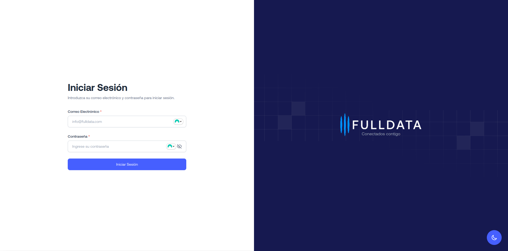

# FULLDATA
Conectados contigo.
Sistema interno de gestión para empresas de telecomunicaciones.



## 📦 Despliegue
- [videoTube](https://fulldata.vercel.app/signin)

## 🧩 Descripción del Proyecto
FULLDATA es una plataforma web diseñada para empresas del sector telecomunicaciones, con el objetivo de centralizar la operación técnica y administrativa. Permite registrar visitas técnicas, materiales utilizados y gestionar contratistas, todo dentro de una interfaz moderna y responsiva.

## Stack de Tecnología 🛠️

 - React 19 con TypeScript — Interfaz moderna, segura y tipada.
 - Redux Toolkit — Manejo de estado global eficiente.
 - TailwindCSS — Estilos rápidos y consistentes.
 - Firebase — Autenticación y backend en tiempo real.
 - ApexCharts — Visualización de datos y métricas.
 - Vite — Bundler veloz para desarrollo moderno.

## Estructura de carpetas 📂
```
├── functions
│   ├── package.json
│   ├── package-lock.json
│   ├── src
│   ├── tsconfig.dev.json
│   └── tsconfig.json
├── index.html
├── package.json
├── public
│   ├── favicon
│   └── images
├── README.md
├── src
│   ├── AppHookContainer.tsx
│   ├── assets
│   ├── components
│   ├── context
│   ├── firebase
│   ├── guards
│   ├── helpers
│   ├── hooks
│   ├── icons
│   ├── index.css
│   ├── main.tsx
│   ├── pages
│   ├── providers
│   ├── redux
│   ├── router
│   ├── svg.d.ts
│   └── vite-env.d.ts
├── firebase.json
├── bun.lock
├── eslint.config.js
├── tsconfig.app.json
├── tsconfig.json
├── tsconfig.node.json
├── vercel.json
└── vite.config.ts
directory: 49 file: 148
```
## Conceptos Técnicos ⚙️

Estaremos practicando varios conceptos:

 1. Diseño Responsive
 2. Renderizado condicional según rol del usuario.
 3. Manejo de rutas protegidas con react-router-dom.
 4. Control de formularios, fechas y validaciones.
 5. Implementación de notificaciones con react-hot-toast.
 6. Dashboard con gráficas dinámicas de ApexCharts.
 7. [Promesas](https://developer.mozilla.org/es/docs/Web/JavaScript/Guide/Using_promises)
